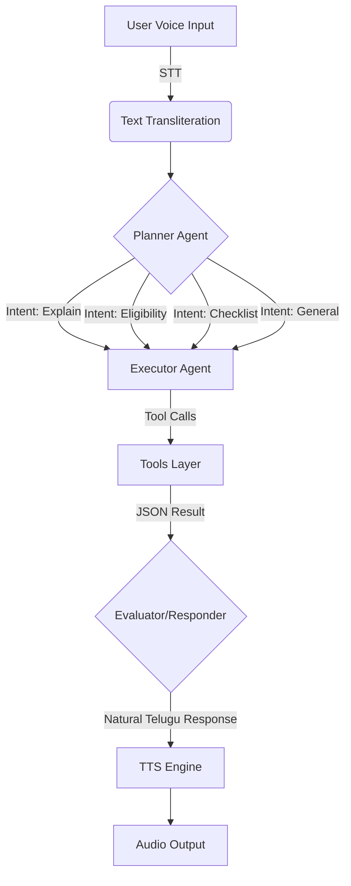

# Architecture Document: Praja Sahayaka (Telugu Voice Agent)

## 1. System Overview
**Praja Sahayaka** is a voice-first, agentic AI system designed to assist users in identifying and applying for government schemes in their native language (Telugu). It operates on a **Planner-Executor-Evaluator** architecture, allowing it to reason, plan, and execute actions autonomously.

## 2. Agentic Workflow
The system follows a strict state-machine flow:

## 3. Component Details

### 3.1. Perception Layer (Input)
- **Voice Input**: Captures audio via Browser Microphone (Streamlit) or System Mic (CLI).
- **STT Engine**: Google Speech Recognition API (`te-IN`) converts audio to Telugu text.
- **Document Analysis**: valid PDF documents are parsed using `PyPDF2` and injected into the context window.

### 3.2. Cognitive Layer (The Brain)
- **Planner Agent**: Analyzes user text to determine **Intent** (e.g., `check_eligibility`, `explain_scheme`). Output: JSON Plan.
- **Executor Agent**: Interprets the JSON Plan and executes specific Python functions.
- **Evaluator Agent (Responder)**: Receives raw data from tools and constructs a warm, empathetic, human-like response in Telugu. Uses **Groq (Llama-3)** for high-speed inference.

### 3.3. Tool Use (Capabilities)
The Executor has access to the following deterministic tools:
1.  **Scheme Retrieval System**: Fuzzy search over `schemes.json` database.
2.  **Eligibility Engine**: Rule-based logic to validate User Data (Age, Income, Occupation) against Scheme Rules.
3.  **Checklist Generator**: Returns required documents for specific schemes.

### 3.4. Memory & Context
- **Conversation History**: Stored in `data/conversation_history.json`.
- **Context Window**: The last 3 turns are retrieved and fed to the Responder to maintain conversational continuity (e.g., handling "What documents do I need for *that*?").

### 3.5. Output Layer
- **TTS Engine**: **Microsoft Edge TTS** (`te-IN-MohanNeural`) generates high-fidelity, neural human speech.
- **UI**: Streamlit interface displays the chat history and plays audio.

## 4. Failure Handling
1.  **STT Errors**: If speech is unclear, the system asks the user to repeat.
2.  **Missing Information**: If a user asks "Am I eligible?" without providing details, the Planner detects `ask_missing_info` and prompts for specifics (Age, Income).
3.  **Unknown Schemes**: If a scheme is not in the local DB, the system falls back to the LLM's internal knowledge base (Semantic Fallback).
4.  **API Errors**: Robust error catching for LLM and TTS services prevents crashes.

## 5. Technology Stack
- **Language**: Python 3.11
- **Framework**: Streamlit (Web UI)
- **LLM**: Meta Llama 3 (via Groq)
- **TTS**: Edge TTS (Neural)
- **Data**: JSON-based NoSQL Mock Database
